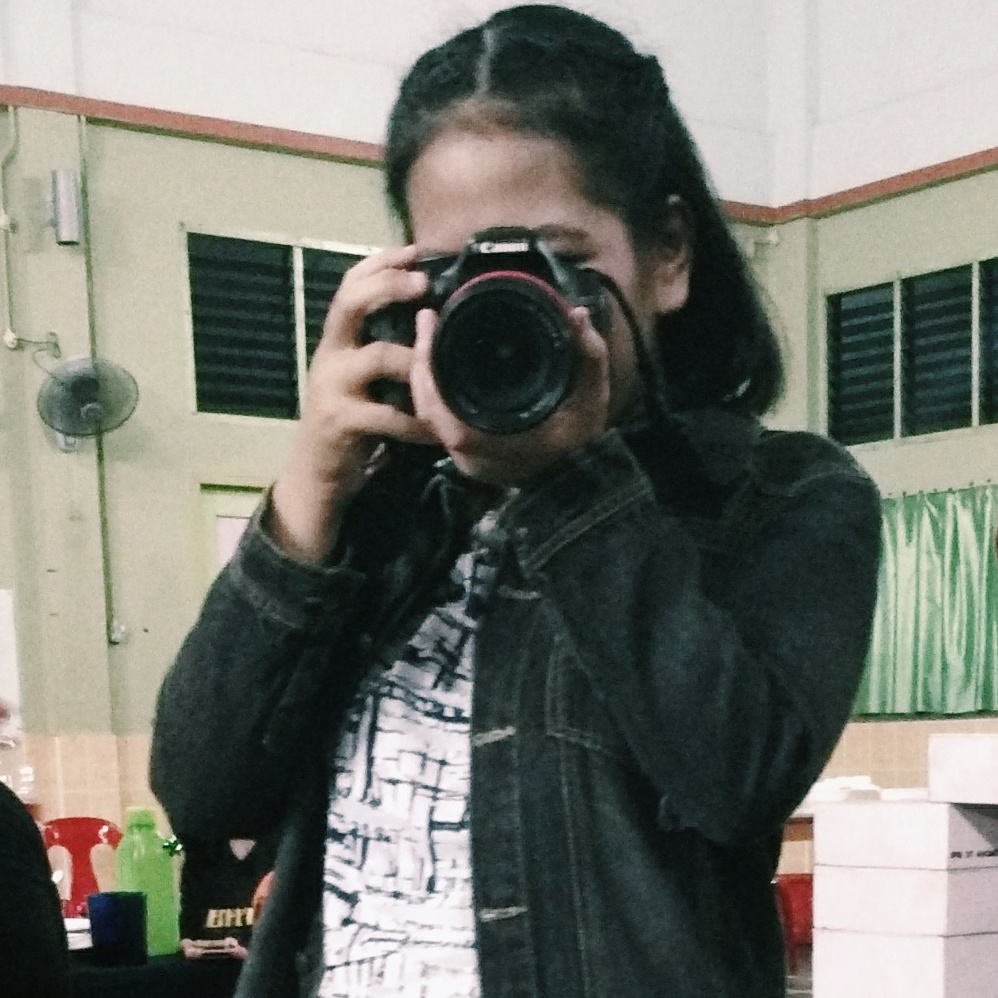

<!DOCTYPE html>
<html>
<title>W3.CSS Template</title>
<meta charset="UTF-8">
<meta name="viewport" content="width=device-width, initial-scale=1">
<link rel="stylesheet" href="https://www.w3schools.com/w3css/4/w3.css">
<link rel="stylesheet" href="https://fonts.googleapis.com/css?family=Montserrat">
<link rel="stylesheet" href="https://cdnjs.cloudflare.com/ajax/libs/font-awesome/4.7.0/css/font-awesome.min.css">

<body class="w3-black">

<!-- Icon Bar (Sidebar - hidden on small screens) -->
<nav class="w3-sidebar w3-bar-block w3-small w3-hide-small w3-center">
  <!-- Avatar image in top left corner -->
  
  <a href="#" class="w3-bar-item w3-button w3-padding-large w3-black">
    <i class="fa fa-home w3-xxlarge"></i>
    
HOME

  </a>
  <a href="#about" class="w3-bar-item w3-button w3-padding-large w3-hover-black">
    <i class="fa fa-user w3-xxlarge"></i>
    
ABOUT

  </a>
  <a href="#photos" class="w3-bar-item w3-button w3-padding-large w3-hover-black">
    <i class="fa fa-eye w3-xxlarge"></i>
    
PHOTOS

  </a>
  <a href="#contact" class="w3-bar-item w3-button w3-padding-large w3-hover-black">
    <i class="fa fa-envelope w3-xxlarge"></i>
    
CONTACT

  </a>
</nav>

<!-- Navbar on small screens (Hidden on medium and large screens) -->

  

    <a href="#" class="w3-bar-item w3-button" style="width:25% !important">HOME</a>
    <a href="#about" class="w3-bar-item w3-button" style="width:25% !important">ABOUT</a>
    <a href="#photos" class="w3-bar-item w3-button" style="width:25% !important">PHOTOS</a>
    <a href="#contact" class="w3-bar-item w3-button" style="width:25% !important">CONTACT</a>
  

<!-- Page Content -->

  <!-- Header/Home -->
  <header class="w3-container w3-padding-32 w3-center w3-black" id="home">
    <h1 class="w3-jumbo">I'm Rachel Chumang</h1>
    
Marketing Manager.

    
  </header>

  <!-- About Section -->
  

    <h2 class="w3-text-light-grey">About Me</h2>
    

    
Some text about me. Some text about me. I am Rachel Chumang Anak Ramsay, a Marketing Manager of Nike Co. Sdn.Bhd with direct working experience in products for personalized marketing. 
	To aim use my proven success in identifying growth opportunities, strategic positioning of different products. . Here, I am looking forward to gain more experience and want to contribute 
	a productive a profitable workforce to your company.Back then, I was an alumni of the UiTM Sarawak Branch from 2012 to 2018. My education background starts with my  Diploma in Business Studies at UiTM Mukah Campus,
	 Sarawak and and supports with my Bachelor in Marketing and continue my Master Degree's in International Business at University Malaya. Every semester I got Dean Award and during my convocation I was awarded the vice cancelor award. I consider myself a problem solver, being able to think outside teh box to provide a solution taht may 
	not be obvious to others.
	 I acknowledges in managerial of business and I a professional person in doing any task. My work will satisfy you.Therefore, with the qualitify of my education, I wish I was given the opportunity to work at your company, and I am very happy to work with you
    

    <h3 class="w3-padding-16 w3-text-light-grey">My Skills</h3>
    
Marketing

    

      

    

    
Marketing Management

    

      

    

    
Photoshop

    

      

    
 
    
    

      

        15+ 
        Partners
      

      

        60+ 
        Projects Done
      

      

        90+ 
        Happy Clients
      

      

        160+ 
        Meetings
      

    

    <button class="w3-button w3-light-grey w3-padding-large w3-section">
      <i class="fa fa-download"></i> Download Resume
    </button>
    
    <!-- Grid for education -->
    <h3 class="w3-padding-16 w3-text-light-grey">My Education Background </h3>
    

      

        <ul class="w3-ul w3-white w3-center w3-opacity w3-hover-opacity-off">
          <li class="w3-dark-grey w3-xlarge w3-padding-32">Basic</li>
          <li class="w3-padding-16">Diploma in Business Studies, University Teknologi Mara, Kampus Mukah</li>
          <li class="w3-padding-16">Bachelor in Marketing, University Teknologi Mara, Kampus Samarahan</li>
          <li class="w3-padding-16">master Degree's in International Business, University Malaya</li>
          
          <li class="w3-light-grey w3-padding-24">
            <button class="w3-button w3-white w3-padding-large w3-hover-black">Sign Up</button>
          </li>
        </ul>
      

    <!-- End Grid/Education -->
    

    
    <!-- Testimonials -->
    <h3 class="w3-padding-24 w3-text-light-grey">My Reputation</h3>  
    
    
Miss Photogenic. CEO at Mighty Schools.

    
Rachel Chumang saved us from a web disaster.
 
    
    
    
Tasha CEO at Company.

    
No one is better than Rachel Chumang, she is the best.

  <!-- End About Section -->
  

  
  <!-- Portfolio Section -->
  

    <h2 class="w3-text-light-grey">My Photos</h2>
    

    <!-- Grid for photos -->
    

      

        
        
        
      

      

        
      

    <!-- End photo grid -->
    

  <!-- End Portfolio Section -->
  

  <!-- Contact Section -->
  

    <h2 class="w3-text-light-grey">Contact Me</h2>
    

    

      
<i class="fa fa-map-marker fa-fw w3-text-white w3-xxlarge w3-margin-right"></i> Kuching, Sarawak

      
<i class="fa fa-phone fa-fw w3-text-white w3-xxlarge w3-margin-right"></i> Phone: +02 387698

      
<i class="fa fa-envelope fa-fw w3-text-white w3-xxlarge w3-margin-right"> </i> Email: chel@mail.com

    
 
    
Let's get in touch. Send me a message:

    <form action="/action_page.php" target="_blank">
      
<input class="w3-input w3-padding-16" type="text" placeholder="Name" required name="Name">

      
<input class="w3-input w3-padding-16" type="text" placeholder="Email" required name="Email">

      
<input class="w3-input w3-padding-16" type="text" placeholder="Subject" required name="Subject">

      
<input class="w3-input w3-padding-16" type="text" placeholder="Message" required name="Message">

      

        <button class="w3-button w3-light-grey w3-padding-large" type="submit">
          <i class="fa fa-paper-plane"></i> SEND MESSAGE
        </button>
      

    </form>
  <!-- End Contact Section -->
  

  
    <!-- Footer -->
  <footer class="w3-content w3-padding-64 w3-text-grey w3-xlarge">
    <i class="fa fa-facebook-official w3-hover-opacity"></i>
    <i class="fa fa-instagram w3-hover-opacity"></i>
    <i class="fa fa-snapchat w3-hover-opacity"></i>
    <i class="fa fa-pinterest-p w3-hover-opacity"></i>
    <i class="fa fa-twitter w3-hover-opacity"></i>
    <i class="fa fa-linkedin w3-hover-opacity"></i>
    
Powered by <a href="https://www.w3schools.com/w3css/default.asp" target="_blank" class="w3-hover-text-green">w3.css</a>

  <!-- End footer -->
  </footer>

<!-- END PAGE CONTENT -->

</body>
</html>
